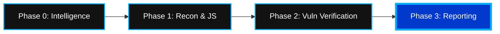

<div align="center">
  
  <br>
  <h1>Tracēhop 🚀</h1>
  <p><b>Advanced JS Reconnaissance & Automated Pentest Orchestrator — v3.1 (Elite)</b></p>

  [](https://www.python.org/downloads/)
  [](https://docs.python.org/3/library/asyncio.html)
  [](https://github.com/Alinshan/tracehop)
  []()

  *An asynchronous, high-precision intelligence suite for modern web reconnaissance.*

  ---
</div>

<br>

**Tracehop** is an enterprise-grade web reconnaissance and automated pentesting tool designed for ultimate speed and stealth. It automates the extraction, auditing, and deep-scanning of infrastructure, JavaScript files, and API endpoints to surface exposed secrets, hardcoded credentials, and critical security vulnerabilities.

With the **v3.1 (Elite)** update, Tracehop integrates a dedicated **Phase 0: Technical Intelligence** stage, a professional **PySide6 Desktop GUI**, and a 4-phase automated **Pentest Orchestration** engine.

<br>

## 💎 Core Modules

| Module | Description | Icon |
| :--- | :--- | :---: |
| **Phase 0: Intelligence** | Deep DNS, SSL, WHOIS, Ports, and GeoIP discovery. | 🔍 |
| **Subdomain Recon** | Passive enumeration via crt.sh & Certificate Transparency. | 🌐 |
| **JS Secret Hunter** | 100+ patterns for Cloud, Payments, and DevOps tokens. | ⚡ |
| **Pentest Orchestrator** | Automated IDOR probing and Source Map leak verification. | 🛡️ |
| **Elite Dashboard** | High-fidelity PySide6 GUI with Phantom Blue aesthetics. | 🖥️ |

<br>

## 🔄 Execution Architecture



### 🛰️ Phase 0: Technical Intelligence
Perform a comprehensive infrastructure audit before starting the scan. Tracehop maps the target's physical location, ISP, and security posture:
- **DNS Records**: A, MX, NS, and TXT resolution.
- **SSL/TLS Audit**: Expiry, Issuer, and SAN inspection.
- **Geo-Location**: Real-time IP resolution and infrastructure mapping.
- **Port Scanning**: Top 20 common service checks (SSH, HTTP, SQL).

<br>

## 🛠️ Setup & Installation

**Prerequisites:** Python 3.8+ required.

### Windows (PowerShell)
```powershell
git clone https://github.com/Alinshan/tracehop.git
cd tracehop
./setup_env.ps1
```

### Linux / macOS (Bash)
```bash
git clone https://github.com/Alinshan/tracehop.git
cd tracehop
pip install -r requirements.txt
```

<br>

## 🚀 Execution & Usage

Tracehop adapts to your workflow with both a high-fidelity GUI and a powerful CLI.

#### 1. Elite Desktop GUI
Launch the visual dashboard for real-time monitoring and advanced filtering:
```bash
python tracehop.py --gui
```

#### 2. Advanced: Pentest Orchestration
Execute the 4-phase automated security audit for a specific domain:
```bash
python tracehop.py example.com --pentest
```

#### 3. Custom Rule Injection (YAML)
Inject your own propriety scanning signatures for internal security audits:
```bash
python tracehop.py example.com --rules my_custom_rules.yml
```

#### 4. Stealth Mode (UA Rotation)
Evasion mode with per-request User-Agent rotation:
```bash
python tracehop.py filter.com --user-agents uas.txt
```

<br>

## 📊 Professional Reporting
Tracehop generates audit-ready reports in both **JSON** and **Markdown** formats.

> [!TIP]
> Use the automatically generated `.md` reports for client-facing deliverables—they include professional severity cards and remediation guidance.

---

<div align="center">
  <h3>Legal Disclaimer</h3>
  <p><i>Tracehop is strictly for authorized security research, defensive auditing, and educational use. Unauthorized scanning of targets is strictly prohibited.</i></p>
  <br>
  <b>© 2026 Alinshan — Phantom Edition</b>
</div>
